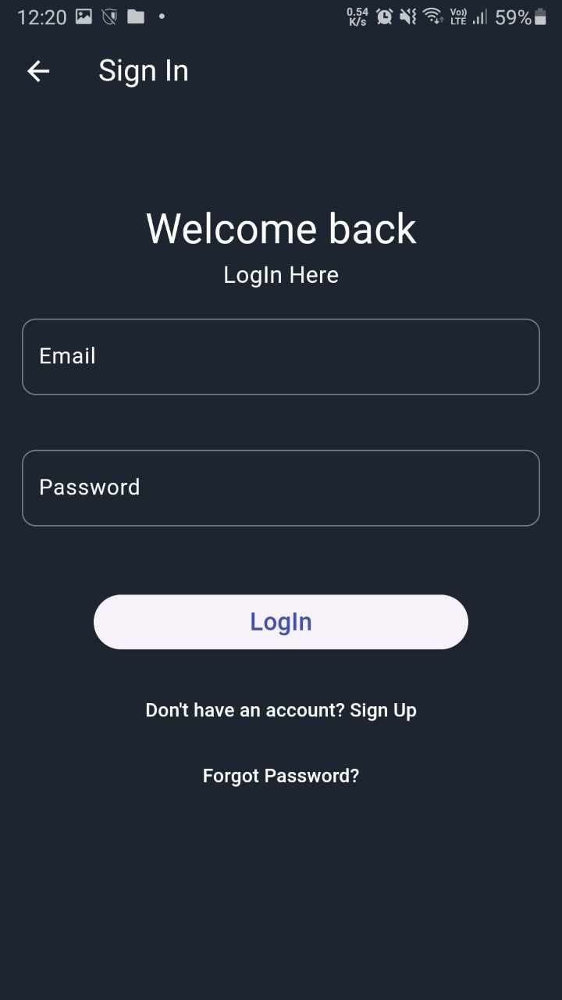
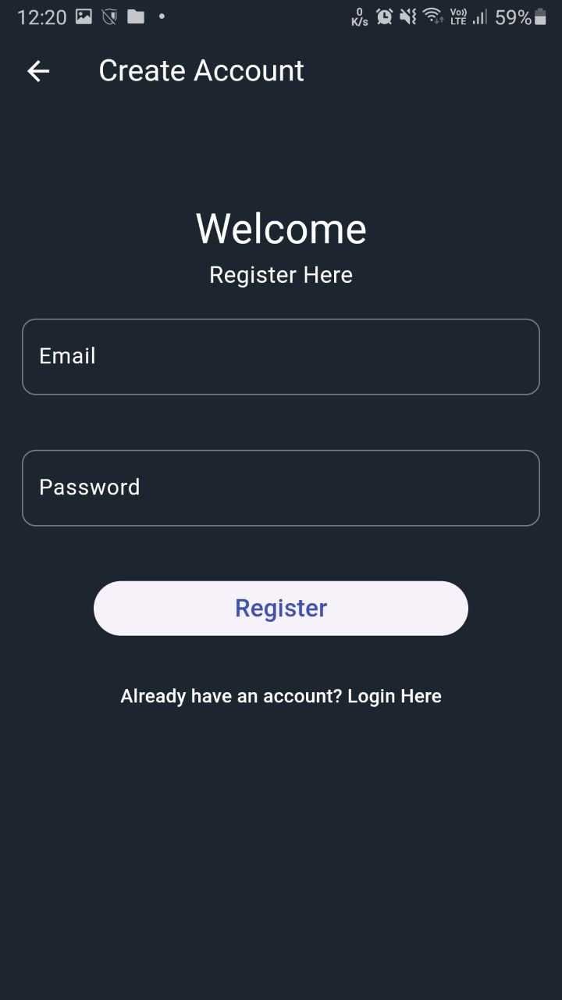
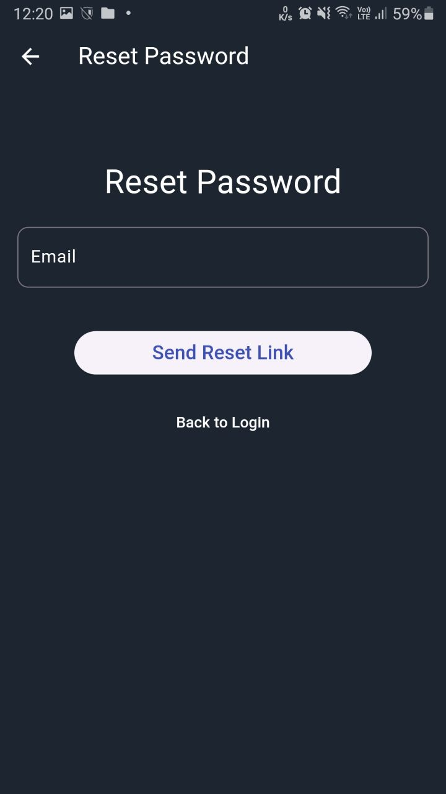
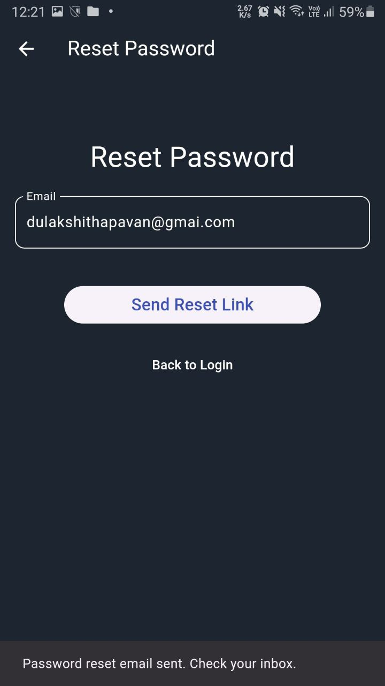
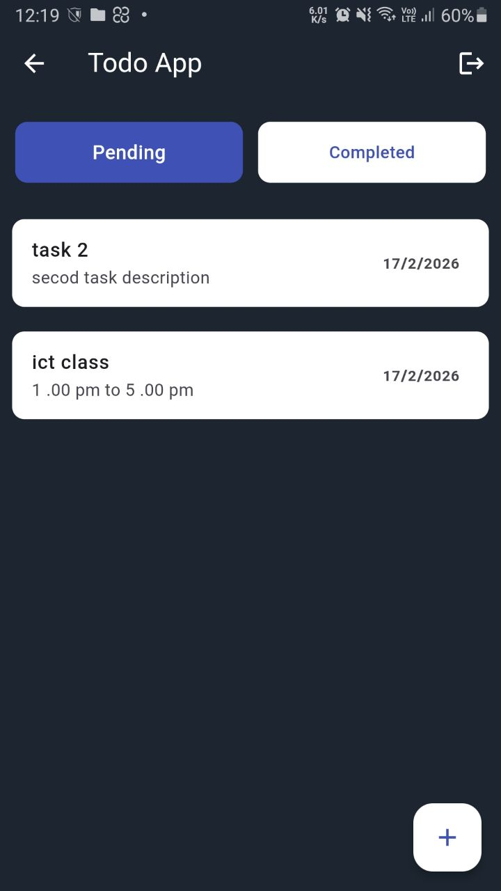
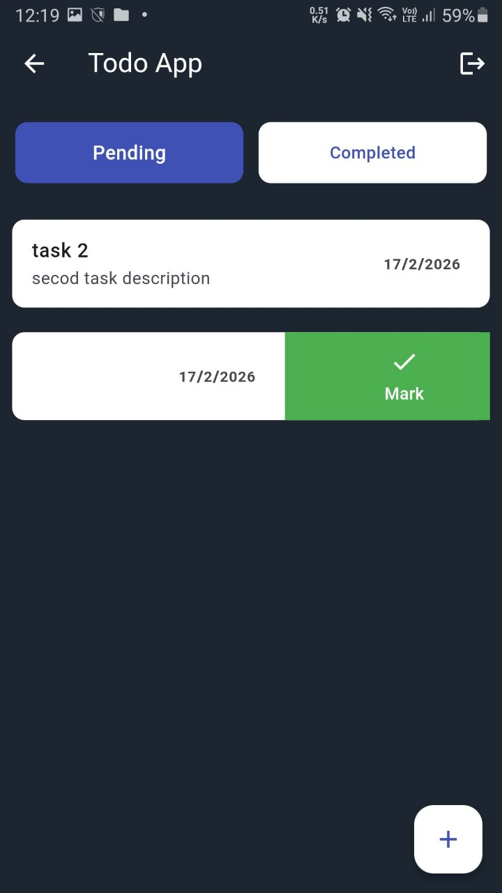
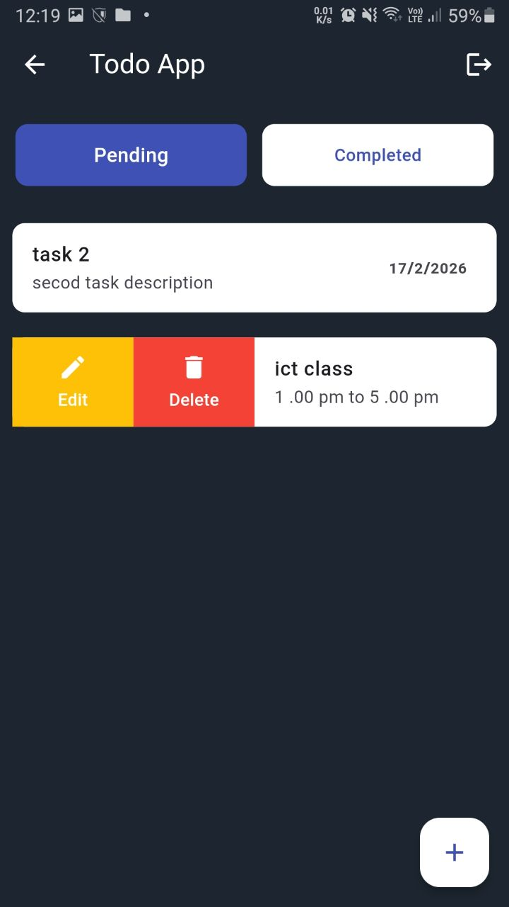
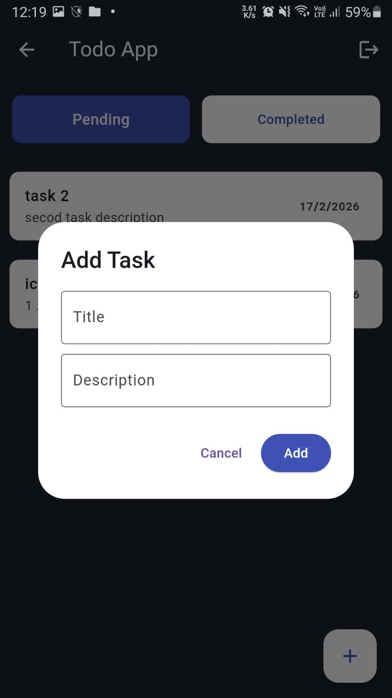
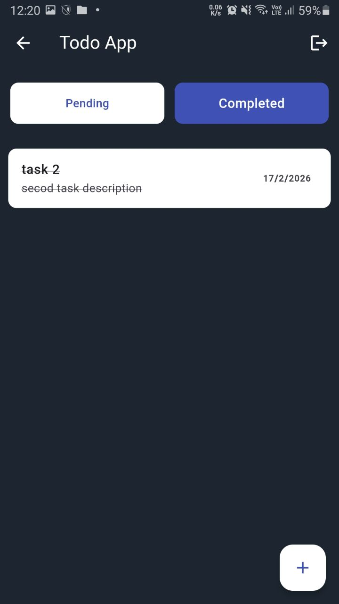
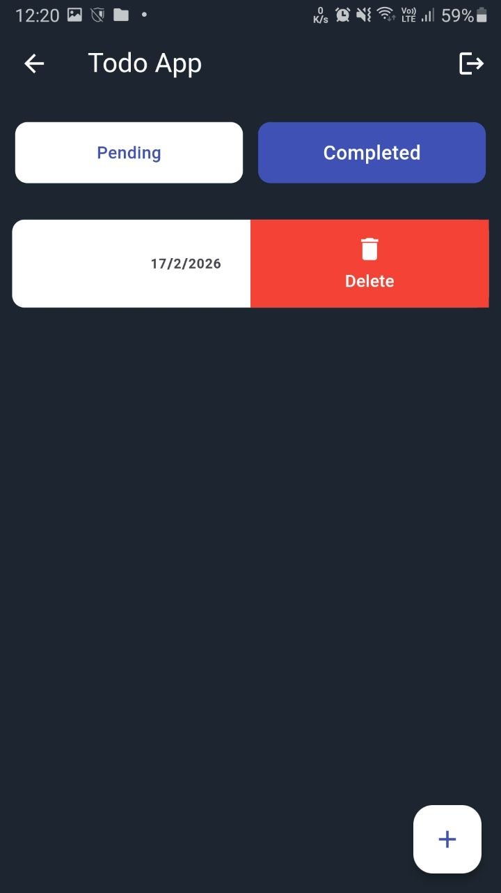

# Flutter Todo App with Firebase Authentication

A feature-rich Todo application built with Flutter and Firebase, designed for learning purposes. This app demonstrates how to implement user authentication, real-time database operations, and modern UI design patterns in Flutter.

## Features

- **User Authentication**
  - Email & Password Sign Up
  - Email & Password Sign In
  - Password Reset via Email
  - Sign Out functionality
  
- **Todo Management**
  - Create new tasks with title and description
  - Edit existing tasks
  - Delete tasks
  - Mark tasks as completed
  - View pending and completed tasks separately
  
- **Real-time Sync**
  - Tasks sync in real-time across devices
  - User-specific data (each user sees only their tasks)
  
- **Modern UI**
  - Dark theme design
  - Swipeable task cards (using Flutter Slidable)
  - Clean and intuitive interface

## Screenshots

<p align="center">
  
  
  
</p>

<p align="center">
  
  
  
</p>

<p align="center">
  
  
  
</p>

<p align="center">
  
</p>

## Technologies & Dependencies

| Package | Version | Purpose |
|---------|---------|---------|
| Flutter SDK | ^3.5.0 | UI Framework |
| firebase_core | ^3.3.0 | Firebase initialization |
| firebase_auth | ^5.1.4 | User authentication |
| cloud_firestore | ^5.2.1 | Real-time database |
| provider | ^6.1.2 | State management |
| intl | ^0.19.0 | Date formatting |
| flutter_spinkit | ^5.2.1 | Loading animations |
| flutter_slidable | ^3.1.1 | Swipeable list items |
| cupertino_icons | ^1.0.8 | iOS style icons |

## Project Structure

```
lib/
├── main.dart                    # App entry point & Firebase initialization
├── home_screen.dart             # Main todo list screen
├── login_screen.dart            # User login screen
├── signup.dart                  # User registration screen
├── password_reset_screen.dart   # Password reset screen
├── firebase_options.dart        # Firebase configuration
│
├── model/
│   └── todo_moddle.dart         # Todo data model
│
├── services/
│   ├── auth_services.dart       # Authentication service (sign in/up/out)
│   └── database_services.dart   # Firestore CRUD operations
│
└── widgets/
    ├── pending_widget.dart      # Displays pending tasks
    ├── completed_widget.dart    # Displays completed tasks
    ├── custom_elevated_button.dart
    ├── custom_text_button.dart
    └── custom_text_form_field.dart
```

## Getting Started

### Prerequisites

- Flutter SDK (^3.5.0)
- Dart SDK
- Firebase account
- Android Studio / VS Code

### Installation

1. **Clone the repository**
   ```bash
   git clone https://github.com/your-username/flutter-todo-app-firebase-auth.git
   cd flutter-todo-app-firebase-auth
   ```

2. **Install dependencies**
   ```bash
   flutter pub get
   ```

3. **Configure Firebase**
   - Create a new project in [Firebase Console](https://console.firebase.google.com/)
   - Enable **Email/Password** authentication in Firebase Auth
   - Create a **Cloud Firestore** database
   - Add your Android/iOS/Web app to the Firebase project
   - Download and add the configuration files:
     - Android: `google-services.json` → `android/app/`
     - iOS: `GoogleService-Info.plist` → `ios/Runner/`
   - Update `firebase_options.dart` with your Firebase config

4. **Firestore Security Rules**
   ```javascript
   rules_version = '2';
   service cloud.firestore {
     match /databases/{database}/documents {
       match /todos/{todoId} {
         allow read, write: if request.auth != null && request.auth.uid == resource.data.uid;
         allow create: if request.auth != null;
       }
     }
   }
   ```

5. **Run the app**
   ```bash
   flutter run
   ```

## Firestore Data Structure

```
todos (collection)
├── {todoId} (document)
│   ├── uid: string          # User ID
│   ├── title: string        # Task title
│   ├── description: string  # Task description
│   ├── completed: boolean   # Task status
│   └── createdAt: timestamp # Creation date
```

## Key Learning Points

This project demonstrates:

1. **Firebase Integration**
   - Initializing Firebase in Flutter
   - Using Firebase Authentication for user management
   - CRUD operations with Cloud Firestore

2. **State Management**
   - Using `StreamBuilder` for real-time data updates
   - Managing UI state with `setState`

3. **Clean Architecture**
   - Separation of concerns (services, models, widgets)
   - Reusable custom widgets
   - Service classes for business logic

4. **Flutter UI Patterns**
   - Form validation
   - Error handling and user feedback
   - Navigation between screens
   - Swipeable list items with actions

5. **User Experience**
   - Loading states
   - Error messages
   - Responsive design

## App Flow

```
┌─────────────┐     ┌─────────────┐     ┌─────────────┐
│   Login     │────▶│  Home       │────▶│  Add Task   │
│   Screen    │     │  Screen     │     │  Dialog     │
└─────────────┘     └─────────────┘     └─────────────┘
       │                   │
       ▼                   ▼
┌─────────────┐     ┌─────────────┐
│   Sign Up   │     │  Logout     │
│   Screen    │     │             │
└─────────────┘     └─────────────┘
       │
       ▼
┌─────────────┐
│  Password   │
│   Reset     │
└─────────────┘
```

## Contributing

This is a learning project. Feel free to fork and experiment!

## License

This project is open source and available for educational purposes.

---

**Made with ❤️ for learning Flutter & Firebase**
